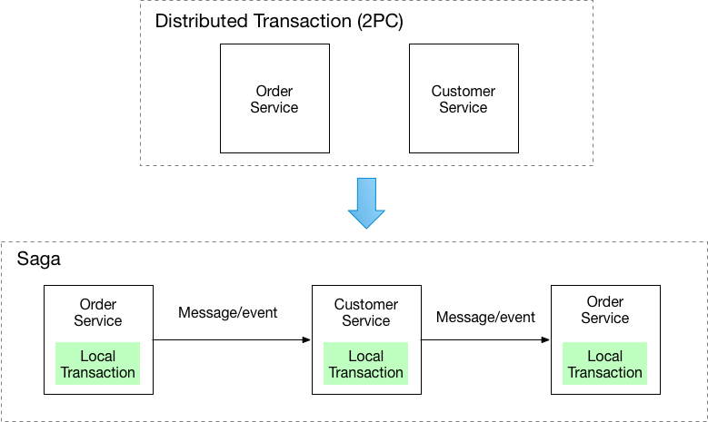
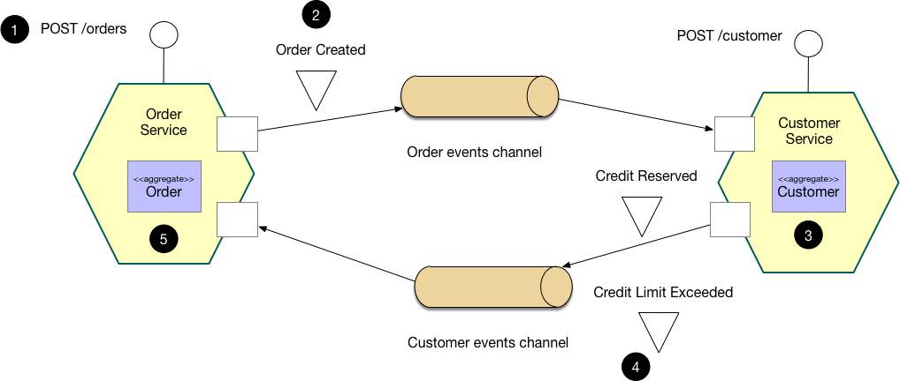
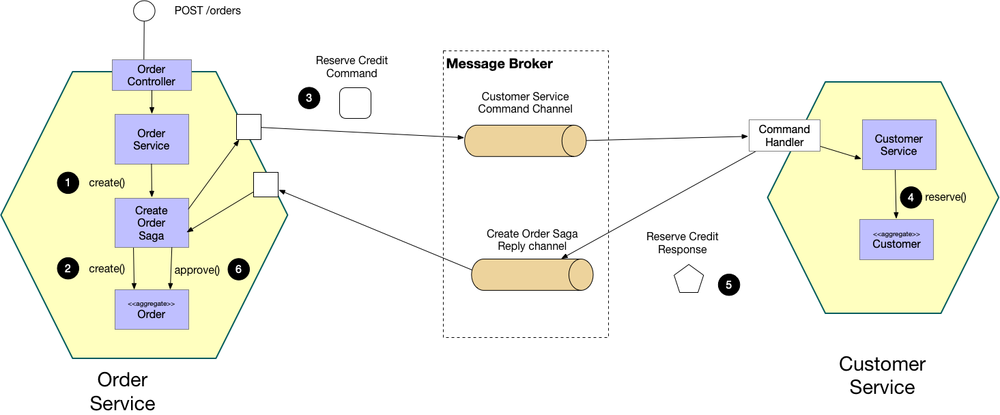

# Микросервисы

## Что такое микросервис
<!-- senior 3525480 -->
Микросервис - это веб-сервис, отвечающий за один элемент логики в некой предметной области (очень похоже на класс). В отличие от монолитного программирования, где все функциональные возможности вашего приложения находятся внутри одного приложения, микросервисы разделяют их на несколько сервисов.

## Преимущества микросервисов
<!-- senior 3525480 -->
**Масштабируемость** - микросервисы могут масштабироваться независимо, что позволяет лучше использовать ресурсы и быстрее масштабировать систему в целом.

**Устойчивость** - архитектура микросервисов позволяет создавать более отказоустойчивые системы, поскольку сбой в одной службе может быть изолирован и обработан без ущерба для всей системы.

**Гибкость** - архитектура микросервисов обеспечивает более быстрые циклы разработки и развёртывания, поскольку изменения могут быть внесены в одну службу без ущерба для всей системы.

**Разнообразие технологий** - архитектура микросервисов обеспечивает гибкость с точки зрения выбора технологии, поскольку каждая служба может быть реализована с использованием различных языков, фреймворков и баз данныхбольше подходящих для конкретной задачи.

**Параллельная разработка** - разные сервисы можно поручить разным командам и вести работу над ними параллельно.

## Недостатки микросервисов
<!-- senior 3525480 -->
**Сложность** - архитектура микросервисов может увеличить сложность системы, поскольку в ней больше движущихся частей и больше взаимодействий между службами.

**Межсервисная связь** - архитектура микросервисов увеличивает количество сетевых вызовов между службами, что может привести к увеличению задержки, а при неправильной обработке - к каскадным сбоям.

**Мониторинг и управление** - архитектура микросервисов требует большего мониторинга и управления, поскольку существует больше сервисов для отслеживания и управления ими.

**Безопасность** - архитектура микросервисов может усложнить внедрение мер безопасности, поскольку каждая служба может нуждаться в индивидуальной защите.

**Тестирование и отладка** - тестирование и отладка архитектуры микросервисов может быть более сложной задачей, поскольку для этого требуется тестирование каждой службы в отдельности, а также тестирование их взаимодействия.

## API Gateway
<!-- senior 3525480 -->
API Gateway - это один из основных шаблонов микросервисов, который используется для обеспечения единой точки входа для внешних потребителей для доступа к сервисам. Он действует как обратный прокси-сервер и уровень маршрутизации, который, помимо прочего, отвечает за маршрутизацию запросов, композицию и трансляцию протокола.

Шаблон шлюза API решает несколько проблем в архитектуре микросервисов:
- Отделяет внешних потребителей от внутренней реализации услуг. Это позволяет сервисам развиваться и масштабироваться независимо, не затрагивая внешних потребителей.
- Обеспечивает единую точку входа для внешних потребителей, что упрощает обнаружение служб на стороне клиента и сокращает количество сетевых вызовов.
- Может решать сквозные проблемы, такие как безопасность, ограничение скорости и кэширование на границе архитектуры, вместо того, чтобы разбрасывать их по службам.
- Может объединять несколько служб в один ответ, сокращая количество сетевых вызовов и повышая производительность клиентской части.
- Может обрабатывать переводы протоколов и типов контента, позволяя реализовывать сервисы с использованием различных протоколов и форматов данных.

## Паттерн Saga
<!-- senior 3525480 -->
Этот паттерн предназначен для управления распределенными транзакциями в микросервисной архитектуре. (Альтернатива 2PC которая решает ту же проблему).
Сага представляет собой набор локальных транзакций. Каждая локальная транзакция обновляет базу данных и публикует сообщение или событие, инициируя следующую локальную транзакцию в саге. Если транзакция завершилась неудачей, например, из-за нарушения бизнес правил, тогда сага запускает компенсирующие транзакции, которые откатывают изменения, сделанные предшествующими локальными транзакциями.

Существует два способа координации саг: хореография и оркестрация.

## Хореография (Choreography)
<!-- senior 3525480 -->
Каждая транзакция публикует события, которые запускают транзакции в других сервисах.

## Оркестровка (Orchestration)
<!-- senior 3525480 -->
Оркестратор говорит участникам, какие транзакции должны быть запущены.

**Преимущества и недостатки Saga**  
\+ Позволяет приложению поддерживать согласованность данных между сервисами без использования распределенных транзакций.  
\- Модель программирования становится более сложной. Например, разработчики должны проектировать компенсирующие транзакции, которые отменяют изменения, сделанные ранее в саге.  

РАСПИСАТЬ ПУНКТЫ ПО ССЫЛКЕ https://microservices.io/patterns/data/saga.html

## SOA
<!-- senior 3525480 -->
Сервис-ориенти́рованная архитектура (СОА, англ. service-oriented architecture- SOA) - научное название микросервисной архитектуры.

## Serverless
<!-- senior 3525480 -->
Безсерверность относится к модели, где серверы находятся где-то удаленно от разработчиков, позволяет запускать программные коды без выделения серверов и управления ими. Вы платите только за фактическое время вычисления.  Это означает, что вам больше не нужно иметь дело с емкостью, развертыванием, масштабированием и отказоустойчивостью и ОС. Это существенно сократит усилия по обслуживанию и позволит разработчикам быстро сосредоточиться на разработке. Примеры: Amazon AWS Lambda, Функции Azure

## Принципы распределенных систем
<!-- senior 3525480 -->
SLA (service level agreements) - принципы работоспособности системы:
- Доступность (Availability) - процент времени, который сервис является работоспособным. Достичь 100% практически невозможно, отличный показатель 99.99
- Точность (Accuracy) - является ли допустимой потеря данных или их неточность? Если да, то какой процент является приемлимым? Для системы платежей этот показатель должен составлять 100%, поскольку данные терять нельзя.
- Пропускная способность(Capacity) - какую нагрузку должна выдерживать система? Этот показатель обычно выражается в запросах в секунду.
- Задержка (Latency) - за какое время система должна отвечать? За какое время должны быть обслужены 95% и 99% запросов?

## Согласованность
<!-- senior 3525480 -->
Это ключевая проблема в высокодоступных системах. Система согласована, если все узлы видят и возвращают одни и те же данные в одно и то же время. В отличие от нашей предыдущей модели, когда мы добавляли больше узлов для достижения большей доступности, удостовериться в том, что система остается согласованной, далеко не так тривиально. Чтобы убедиться в том, что каждый узел содержит одну и ту же информацию, они должны отправлять сообщения друг другу, чтобы постоянно быть сихронизированными. Однако, сообщения, отправленные ими друг другу, могут быть не доставлены - они могут потеряться и некоторые из узлов могут быть недоступными.

## Идемпотентность
<!-- senior 3525480 -->
В случае с распределёнными системами, может пойти не так всё что угодно - соединения могут отваливаться посередине или запросы могут выпадать по тайм-ауту. Клиенты будут часто повторять эти запросы. Идемпотентная система гарантирует, что чтобы ни произошло, и сколько бы раз конкретный запрос ни выполнялся, действительное выполнение этого запроса происходишь всего один раз. Хороший пример - это осуществление платежа. Если клиент создает запрос на оплату, запрос успешен, но если клиент попадает в тайм-аут, то клиент может повторить тот же самый запрос. В случае с идемпотентной системой, с человека, производящего оплату, не будут дважды списаны деньги; а вот для не-идемпонетной системы это вполне возможное являение.

## Взаимодействие между сервисами
<!-- senior 3525480 -->
https://habr.com/ru/companies/maxilect/articles/677128/

## Service mesh
<!-- senior 3525480 -->

## Falcon
<!-- senior 3525480 -->
https://falcon.readthedocs.io/en/stable/

## Микросервисы на основе событий с Dapr
<!-- senior 3525480 -->
https://habr.com/ru/companies/otus/articles/706186/

## Databus
<!-- senior 3525480 -->
https://habr.com/ru/companies/ozontech/articles/749328/

## Очереди
<!-- senior 3525480 -->
В веб-приложениях очереди часто используются для отложенной обработки событий или в качестве временного буфера между другими сервисами, тем самым защищая их от всплесков нагрузки.
Консьюмеры получают данные с сервера, используя две разные модели запросов: pull или push.

## Transactional Outbox
<!-- senior 3525480 -->

## Transactional Inbox
<!-- senior 3525480 -->
