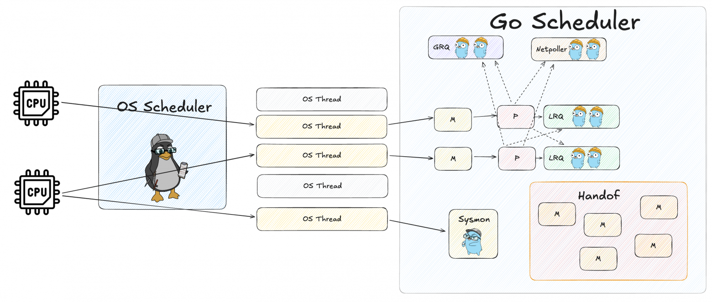

# Scheduler

## Конкурентность
Это способность программы управлять несколькими задачами одновременно, но не обязательно выполнять их в один и тот же момент времени.  
Задачи чередуются (переключаются между собой), создавая иллюзию параллельного выполнения. Подходит для I/O-bound задач (ожидание ввода-вывода, например, чтение файлов, сетевые запросы).  

## Параллелизм
Это реальное одновременное выполнение задач на нескольких ядрах/процессорах.  
Требует многоядерного CPU или распределённых систем. Подходит для CPU-bound задач (тяжёлые вычисления, например, обработка изображений, машинное обучение).  

## Вытесняющая многозадачность
Планировщик принудительно останавливает выполнение одной задачи и передаёт управление другой, даже если первая не завершилась.  
Планировщик решает, когда переключиться на другую задачу (на основе квантов времени, приоритетов и т.д.).  
✅ Если одна задача зависла, остальные продолжают работать.  
❌ Больше накладных расходов на переключение.  

## Кооперативная многозадачность
Задачи добровольно передают управление планировщику (например, вызывая `runtime.Gosched()`). Если задача не отдаст управление, система "зависнет".  
✅ Контроль со стороны программы.  
✅ Меньше накладных расходов (на переключение задач).  
❌ Риск зависания

## Процесс
Изолированный экземпляр программы со своим адресным пространством, ресурсами (память, файлы) и состоянием. Создается ОС при запуске программы.  
✅ Изоляция: Процессы не могут напрямую вмешиваться в память друг друга (без специальных механизмов IPC).  
✅ Надежность: Если один процесс упадет, другие продолжат работу.  
❌ Большие накладные расходы: Создание и переключение между процессами медленнее, чем у потоков.  

## Тред
Часть процесса, выполняющаяся внутри него и использующая его память и ресурсы. У одного процесса может быть много потоков.  
✅ Легковесность: Создание и переключение потоков быстрее, чем процессов.  
✅ Общая память: Потоки одного процесса могут обмениваться данными через общую память.  
❌ Нет изоляции: Ошибка в одном потоке может "убить" весь процесс.  
❌ Проблемы синхронизации: Нужны мьютексы, семафоры и т. д., чтобы избежать гонки данных (race conditions).

## Context switching
Это механизм, при котором ядро ОС сохраняет состояние текущего потока/процесса и загружает состояние другого.  
Планировщик ОС может в произвольные моменты времени переключать треды - отключать выполняющиеся от ядра процессора и заменять их Runnable тредами.  
Переключение контекста, занимает довольно много времени: нужно обновить данные в кэшах процессора, сохранить состояние треда и др.  
Если переключений слишком много, то всем они суммарно могут занимать столько же времени, сколько само выполнение задач (а то и больше).  

Каждый тред может находиться в одном из трёх состояний:
1. Executing: выполняется прямо сейчас на одном из ядер
2. Runnable: готов к выполнению, дожидается своей очереди
3. Waiting: не готов к выполнению, так как ждёт какого-то события. Например, это может быть связано с i/o операцией, взаимодействием с ОС (syscall) и др.

## syscall
Системный вызов - это механизм, с помощью которого пользовательские программы могут запрашивать услуги ядра операционной системы.  

Пользовательские программы работают в непривилегированном режиме (user space) и не имеют прямого доступа к аппаратным ресурсам (жесткому диску, сети, процессору и т.д.). 
Чтобы выполнить привилегированные операции (например, открыть файл или создать процесс), программа делает системный вызов, передавая управление ядру ОС.  

Системные вызовы могут стать узким местом в производительности, особенно в высоко нагруженных приложениях. Вот несколько подходов к их сокращению:
* Буферизация ввода-вывода (пакет `bufio`)
* Пакетная обработка данных
* Использование sendfile для копирования файлов
* Асинхронный ввод-вывод (через io_uring или epoll)
* Кеширование метаданных файлов
* Использование mmap (отображение файлов в память)

В Linux системные вызовы можно разделить на синхронные и асинхронные. Большинство системных вызовов по умолчанию работают синхронно — они блокируют выполнение процесса/потока до завершения операции.
Не все syscall'ы поддерживают асинхронную работу. К примеру, сетевые операции поддерживают, а файловые — нет.

## GOMAXPROCS
Переменная окружения, определяет, сколько потоков ОС будет использоваться для горутин.  
Обычно равно количеству ядер CPU. Можно проверить с помощью `runtime.NumCPU()`.  

При запуске горутины создается новый тред если их меньше чем `GOMAXPROCS` либо горутина ждет, пока не освободится один из тредов.  
`runtime.GOMAXPROCS(2)` - ограничиваем планировщик двумя тредами.

Дополнительные треды под системный монитор ???

## Machine
Машина для выполнения (тред), будет непосредственно выполнять горутину.  
M:N Threading - модель работы в го, заключается в том, что мы выполняем N горутин на M тредах.  

## Processor
Процессор, будет помещать горутины (G) в Машину.  
У каждого треда свой процессор.  
Процессор может брать работу в двух местах - LRQ и GRQ. 
Чтобы горутины в GRQ не застаивались, один раз из 61 будет брать оттуда.  
Процессор блокирует GRQ с помощью мьютекса, чтобы извлечь горутину в работу.

## GRQ
Global Run Queue - очередь для задач еще не попавших в LRQ.  

## LRQ
Local Run Queue - каждая новая горутина, которой не достался тред, будет отправляться в LRQ и ждать своего часа.  
В этой очереди находятся горутины готовые к работе (Runnable).  

## Waiting горутины
Это те горутины, которые чем-то заблокированы и не могут быть запущены.  
Процессору не придется следить за Waiting горутинами, этим будут заниматься другие сущности.  
К примеру, если горутина заблокирована из-за чтения или записи в канал, то она попадёт в Wait Queue этого канала, и уже оттуда попадёт в GRQ и LRQ. Аналогичные механизмы также есть у мьютексов, таймеров и Network IO.  

## Work stealing
Если LRQ одного Процессора пустая, то он заглянет в LRQ любого другого Процессора и возьмёт горутину оттуда.  
Или даже лучше — пусть он заберёт оттуда сразу половину горутин, чтобы не ходить потом лишний раз.  

## Handoff
Если тред заблокирован системным вызовом, он больше не может выполнять работу. В таком состоянии он нам не особо полезен, поэтому мы просто отвяжем его от Процессора, создадим новый тред и привяжем к Процессору его.  
Большое количество syscall'ов всегда будет порождать большое количество тредов.  

## Sysmon
System Monitor - это внутренний компонент рантайма, который работает в фоновом режиме и выполняет критические задачи для поддержки работы горутин, сборки мусора (GC) и других аспектов планировщика.

Sysmon — это отдельная горутина (runtime.sysmon), которая запускается при старте Go-программы и работает в бесконечном цикле.  
Начинает с частоты ~20 µs (микросекунд). Постепенно увеличивает интервал до ~10 ms (миллисекунд), если система не перегружена.  
Если горутина "застряла" в syscall дольше 20 ms, Sysmon может отвязать P от M (OS-треда) и создать новый M, чтобы другие горутины могли работать.  
`runtime.LockOSThread()` - ???

## Network Poller (netpoller)
Блокировка треда при системном вызове, это ограничение на уровне операционной системы, то есть программно мы никак не можем с этим бороться.
Но, к счастью, сама ОС обычно предоставляет механизмы, с помощью которых это ограничение можно обойти.
А именно, это механизмы для выполнения асинхронных системных вызовов, например: epoll (Linux), kqueue (MacOS, BSD), IOCP (Windows).

netpoller - ведет учёт системных вызовов, которые нужно проверить на наличие ответов.  

Если горутина собирается выполнить системный вызов, который может выполняться асинхронно, мы, вместо блокировки треда:
* Регистрируем операцию в Network Poller
* Переводим горутину в состояние Waiting и передаём её Netpoller'у
* Процессор освобождается для выполнения других горутин

Ждущие горутины не занимают тред, и могут находиться в таком состоянии сколько понадобится, никак не замедляя работу программы.  
```go
// Это будет работать через netpoller
conn, _ := net.Dial("tcp", "example.com:80")
data, _ := conn.Read(buf)

// А это заблокирует тред
file, _ := os.Open("bigfile.dat")
data, _ := file.Read(buf)
```

## Вытеснение горутин
Вытеснение нужно выполнять в те моменты, которые безопасны и оптимальны для вытеснения. Лучше всего нам подходят вот такие точки:

**Перед вызовом функций (пролог)**: Когда функция вызывается, создаётся фрейм стека (выделенная область в памяти, где хранятся локальные переменные, адрес возврата и другие данные функции). При прерывании в момент вызова функции вся нужная информация уже сохранена во фрейме, поэтому горутину можно приостановить без риска потерять данные. При возобновлении выполнения горутина начнёт с этого вызова функции, используя те же значения переменных.

**При совершении блокирующих операций** (наши любимые syscall'ы, таймеры и прочее): в эти моменты горутина всё равно будет ждать и простаивать, поэтому пусть поработает кто-то другой.

**stackguard** флаг, который показывает горутине, что ей пора уступить процессор. Устанавливается значение `stackPreempt`. При следующей проверке горутина увидит это значение и поймет, что ей пора передать управление планировщику.  

Sysmon установит флаг `stackguard=stackPreempt` если горутина слишком долго выполняется.  

Два способа вытеснения:
* Основной - через проверку `stackguard` в безопасных точках. Горутина сама решает когда остановиться.
* Запасной - через сигналы операционной системы, если горутина не хочет останавливаться сам (примерно более 20мс).

Правда, второй способ работает не всегда. В некоторых участках кода прерывать горутину опасно — например, во время сборки мусора или выполнения системных вызовов. В таких случаях нам остается полагаться только на первый способ.

**Принудительное вытеснение жадных горутин в Go v1.14**  
Горутина может выполнять вычисления (например в бесконечном цикле) и не вызывать другие функции, а значит не проверяет флаг `stackguard` и не завершается блокируя тред.  

## Сигналы
Это механизм уведомления процессов о каких-либо событиях на уровне ОС. Ключевой для нас момент - при отправке сигнала, ОС прерывает выполнение процесса и запускает специальный обработчик, который установил сам процесс. Именно этот обработчик сохранит состояние горутины и вернёт управление планировщику.

Если горутина не хочет останавливаться ей подается сигнал `SIGURG` (в UNIX).  

## Полная схема работы
Алгоритм поиска работы для каждого Процессора выглядит так:
1. 1/61 раз проверяем GRQ, и если там есть горутины, то берём оттуда
2. Если нет, проверяем LRQ
3. Если там нет, пытаемся украсть у другого Процессора
4. Если не получилось, проверяем GRQ
5. Проверяем Network Poller


