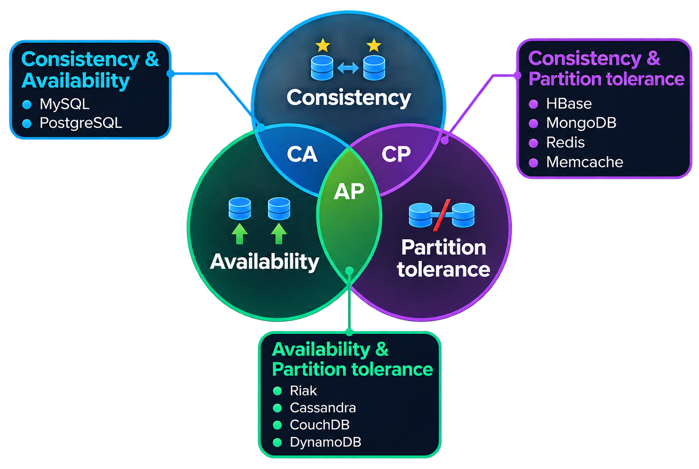

# Реляционная теория

## Какие типы СУБД бывают
<!-- junior 3525480 -->
**Реляционные** - поддерживают установку связей между таблицами с помощью первичных и внешних ключей. Например Postgres, MySQL, Sqlite.

NoSQL:  
**Ключ-значение (Key-value)** - наиболее простой вариант хранилища данных, использующий ключ для доступа к значению в рамках большой хэш-таблицы.
Например Redis, Memcached.

**Документо-ориентированное хранилище** - Например MongoDB.  
**Колоночное хранилище** - Например Clickhouse.

## Теорема CAP
<!-- middle 3525480 -->
Теорема CAP утверждает, что распределенное хранилище данных может обладать только двумя из трех свойств:  
**Соглассованность (consistency)** - (определенная иначе, чем в принципах ACID) любая операция чтения возвращает самое актуальное состояние данных, образовавшиеся после последней операции записи, независимо от того, какой узел опрашивается.  
**Доступность (availability)** - любой запрос к системе завершается успешно (но результат может оказаться несогласованным).  
**Устойчивость к разделению (partition tolerance)** - система продолжает работать, даже если некоторые ее части недоступны или кластер распался на несвязанные части.

## BASE
<!-- middle 3525480 -->
Базы данных NoSQL охватывают ситуации, когда модель ACID избыточна или фактически препятствует работе базы данных. Вместо этого NoSQL опирается на более мягкую модель, известную, соответственно, как модель BASE.

Базовая доступность - подход к базе данных NoSQL фокусируется на доступности данных даже при наличии множества сбоев. Это достигается путем использования распределенного подхода к управлению базами данных.

Soft State - Базы данных BASE практически полностью отказываются от требований согласованности модели ACID. Одна из основных концепций, лежащих в основе BASE, заключается в том, что согласованность данных является проблемой разработчика и не должна обрабатываться базой данных.

Возможная последовательность - единственное требование, которое базы данных NoSQL имеют в отношении согласованности, — это требование, чтобы в какой-то момент в будущем данные сходились в согласованное состояние. Однако нет никаких гарантий относительно того, когда это произойдет.

## OLTP
<!-- middle 3525480 -->
(Online Transaction Processing), транзакционная система в которой обработка транзакций происходит в реальном времени. Способ организации БД, при котором система работает с небольшими по размерам транзакциями, но идущими большим потоком, и при этом клиенту требуется от системы минимальное время отклика.

## OLAP
<!-- middle 3525480 -->
(online analytical processing, интерактивная аналитическая обработка) - технология обработки данных, заключающаяся в подготовке суммарной (агрегированной) информации на основе больших массивов данных, структурированных по многомерному принципу.

## Нормальная форма
<!-- middle 3525480 -->
Нормализация - это процесс удаления избыточных данных. Избыточность устраняется, как правило, за счёт декомпозиции отношений (таблиц), т.е. разбиения одной таблицы на несколько.

Избыточность данных - это когда одни и те же данные хранятся в базе в нескольких местах, именно это и приводит к аномалиям. Так как в этом случае необходимо добавлять, изменять или удалять одни и те же данные в нескольких местах.

Зачем нормализовать базу данных:
- Устранения аномалий
- Повышения производительности
- Повышения удобства управления данными

Нормальные формы (в порядке возрастания нормализации):
- Ненормализованная форма или нулевая нормальная форма (UNF)
- Первая нормальная форма (1NF)
- Вторая нормальная форма (2NF)
- Третья нормальная форма (3NF)
- Нормальная форма Бойса-Кодда (BCNF)
- Четвертая нормальная форма (4NF)
- Пятая нормальная форма (5NF)
- Доменно-ключевая нормальная форма (DKNF)
- Шестая нормальная форма (6NF)

### Не нормализованная форма
Когда таблица не соответствует реляционной теории (строки в таблицах не должны быть пронумерованы, то есть порядок строк не имеет значения. Так же не имеет значение порядок столбцов. Таким образом, по реляционной теории мы не можем обратиться к определѐнной строке или столбцу по ее номеру.). Пример - таблица excel.

### Первая нормальная форма
Требование первой нормальной формы (1NF) очень простое и оно заключается в том, чтобы таблицы соответствовали реляционной модели данных и соблюдали определённые реляционные принципы:
- В таблице не должно быть дублирующих строк
- В каждой ячейке таблицы хранится атомарное значение (одно не составное значение)
- В столбце хранятся данные одного типа
- Отсутствуют массивы и списки в любом виде

### Вторая нормальная форма
Чтобы таблица находилась во второй нормальной форме (2NF), необходимо чтобы она удовлетворяла следующим требованиям:
- Таблица должна находиться в первой нормальной форме
- Таблица должна иметь первичный ключ
- Все неключевые столбцы таблицы должны зависеть от полного ключа (в случае если он составной) Иными словами, в таблице не должно быть данных, которые можно получить, зная только половину ключа, т.е. только один столбец из составного ключа.

### Третья нормальная форма
Отношение находится в 3NF, когда находится во 2NF и каждый не ключевой атрибут нетранзитивно зависит от первичного ключа. Проще говоря, второе правило требует выносить все не ключевые поля, содержимое которых может относиться к нескольким записям таблицы в отдельные таблицы.
На практике таблицы обычно приводят к 3 нормальной форме.  

https://habr.com/ru/articles/254773/

## ACID свойства транзакций
<!-- middle 3525480 -->
Atomicity (атомарность) - выражается в том, что транзакция должна быть выполнена в целом или не выполнена вовсе.

Consistency (согласованность) - гарантирует, что по мере выполнения транзакций, данные переходят из одного согласованного состояния в другое, то есть транзакция не может разрушить взаимной согласованности данных.

Isolation (изолированность) - локализация пользовательских процессов означает, что конкурирующие за доступ к БД транзакции физически обрабатываются последовательно, изолированно друг от друга, но для пользователей это выглядит, как будто они выполняются параллельно.

Durability (долговечность) - устойчивость к ошибкам - если транзакция завершена успешно, то те изменения в данных, которые были ею произведены, не могут быть потеряны ни при каких обстоятельствах.

## Оптимизация SQL запросов
<!-- middle 3525480 -->
1. Отслеживать медленные запросы (поставить расширение, настроить лог медленных запросов или хотя бы debug toolbar в приложении).
2. Не выбирать все поля в селект, а только необходимые.
3. Стараться не использовать подзапросы.
4. Join использовать в правильном порядке, чтобы сократить число записей.
5. Оптимизатор лучше справляется с простыми запросами.
6. Использование индексов для полей которые фигурируют в условиях.
7. Денормализация (в некоторых случаях).
8. Условия AND в блоке WHERE должны располагаться в порядке возрастания вероятности.
9. Условия OR в блоке WHERE должны располагаться в порядке убывания вероятности.
10. LIKE, DISTINCT при острой необходимости.
11. Избегать блокировок:
     - использовать как можно более низкий уровень изоляции транзакций.
     - стараться делать транзакции короткими.
