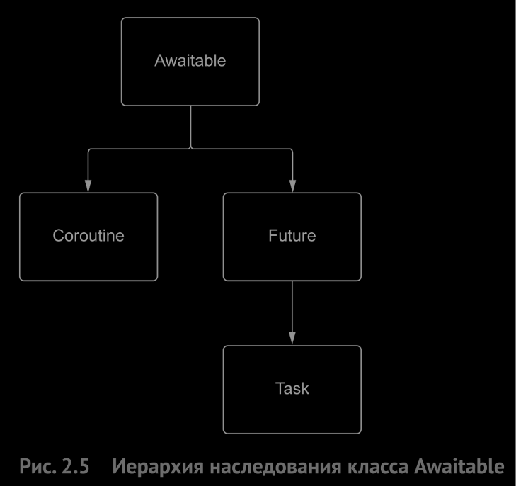

# Asyncio

## Какой вид многозадачности
В asyncio для организации конкурентности используется кооперативная многозадачность. Когда приложение доходит до точки, в которой может подождать результата, мы явно помечаем это в коде. Поэтому другой код может работать, пока мы ждем получения результата, вычисляемого в фоновом режиме. Как только вычисление результата завершится, мы «просыпаемся» и возобновляем задачу. Это является формой конкурентности, потому что несколько задач может работать одновременно, но – и это очень важно – не параллельно, так как их выполнение чередуется.

## Что такое асинхронное программирование
В синхронном коде каждая операция ожидает окончания предыдущей. Поэтому вся программа может зависнуть, если одна из команд выполняется очень долго. Асинхронный код убирает блокирующую операцию из основного потока программы, так что она продолжает выполняться, но где-то в другом месте, а обработчик может идти дальше.

## Event Loop
Цикл событий - это основа asyncio-приложения. Циклы событий запускают асинхронные задачи, выполняют сетевые операции ввода-вывода и запускают подпроцессы.

## Coroutine
Cпециальные функции, похожие на генераторы python, от которых ожидают (await), что они будут отдавать управление обратно в цикл событий. Обычно запускаются в цикле событий но могут быть запущены и на прямую с помощью метода .send().

## Await
В точке, где встречается первое после создания задачи предложение await, все ожидающие задачи начинают выполняться, так как await запускает очередную итерацию цикла событий.

## Task
Task - это обертка вокруг корутины, которая планирует выполнение последней в цикле событий как можно раньше. И планирование, и выполнение происходят в неблокирующем режиме, т. е., создав задачу, мы можем сразу приступить к выполнению другого кода, пока эта задача работает в фоне.

## Future
Объекты, в которых хранится текущий результат выполнения асинхронной операции. Это может быть информация о том, что задача ещё не обработана или уже полученный результат; а может быть вообще исключение.

## Asyncio.sleep(0)
Позволяет принудительно остановить текущую задачу и перезапустить цикл событий.

## Awaitable
Корутины, задачи, футуры являются Awaitable, то есть можно ждать их выполнения с помощью await.



## __ await __
Когда класс реализует метод \_\_await__ его можно использовать с ключевым словом await.

```python
class MyClass:
    def __await__(self):
        # return the generator
        return asyncio.sleep(2).__await__()

obj = MyClass()
await obj
```

## Debug
В режиме отладки asyncio приложение может сигнализировать о долго выполняющихся операциях (loop.slow_callback_duration).

## Обработка исключений
Исключение из корутины выбрасывается в момент когда происходит ее await (даже если задача отменяется в другом месте).

Если корутина обернута в задачу, то чтобы перехватить исключение из нее нужно либо подождать выполнения задачи с помощью await и обернуть это в try\except. Либо подождать пока задача выполнится и получить исключение с помощью future.exception(). Если этого не сделать то исключение пробросится на ружу и скрипт будет аварийно завершен.

Если исключение в задаче не перехвачено то оно выбрасывается в момент сборки мусора. Но если задача лежит например в списке задач tasks: List, то исключение не выбросится до момента уничтожения этого списка.

## asyncio.gather()
Для запуска большого количества задач можно использовать функцию asyncio.gather(*coros). Она помогает запускать задачи конкурентно., а так же подождать выполнения всех переданных ей задач. Результаты выполнения задач будут возвращены в том же порядке.

return_exceptions=False - это режим по умолчанию. Если хотя бы одна сопрограмма возбуждает исключение, то gather возбуждает то же исключение в точке await. Но, даже если какая то сопрограмма откажет, остальные не снимаются и продолжат работать при условии, что мы обработаем исключение и оно не приведет к остановке цикла событий и снятию задач. Будет возбуждено только первое исключение даже если их было несколько.

return_exceptions=True - в этом случае исключения возвращаются в том же списке, что результаты. Сам по себе вызов gather не возбуждает исключений, и мы можем обработать исключения, как нам удобно.

## asyncio.as_completed()
Позволяет запустить несколько задач на выполнение при этом получать результаты их работы не по порядку вызова а по готовности. А так же удобнее обрабатывать исключения.

## asyncio.wait()
Один из недостатков обеих функций gather и as_completed – сложности со снятием задач, работавших в момент исключения.

done, pending = await asyncio.wait(fetchers, return_when=asyncio.ALL_COMPLETED)  
работает как gether, то есть pending всегда будет пуст.

done, pending = await asyncio.wait(fetchers, return_when=asyncio.FIRST_EXCEPTION)  
В этом режиме выполнение будет происходить до первого исключения.

done, pending = await asyncio.wait(fetchers, return_when=asyncio.FIRST_COMPLETED)  
В этом режиме wait возвращает управление, как только получен хотя бы один результат. Это может быть как успешно завершившаяся задача, так и задача, в которой возникло исключение. Остальные задачи можно либо снять, либо дать им возможность продолжать работу.


## Гонка в однопоточном asyncio приложении
Может возникнуть если корутина прочитала глобальную переменную и положила ее значение в собственную локальную, потом прервалась из-за await и после возобновления работы записала в глобальную переменную результат из локальной.

Ключевое различие между ошибками многопоточной и однопоточной конкурентности заключается в том, что в многопоточном приложении состояния гонки возможны везде, где модифицируется разделяемое состояние. А в модели однопоточной конкурентности нужно модифицировать состояние в точке await.

Чтобы избежать ошибок нужно либо не модифицировать данные когда корутина приостоновлена либо использовать блокировки.

## Synchronization Primitives
Примитивы синхронизации asyncio спроектированы так, чтобы быть похожими на примитивы модуля threading с двумя важными оговорками:
- Примитивы asyncio не потокобезопасны, поэтому их не следует использовать для синхронизации потоков ОС (используйте для этого threading приметивы).
- Методы этих примитивов синхронизации не принимают аргумент тайм-аута. Нужно использовать функцию asyncio.wait_for() для выполнения операций с тайм-аутами.

В asyncio доступны следующие примитивы: Lock, Event, Condition, Semaphore, BoundedSemaphore, Barrier

## asyncio.Lock
Блокировки asyncio работают так же, как блокировки в модулях, обеспечивающих многопоточность и многопроцессность. Мы захватываем блокировку, делаем что-то внутри критической секции, а по завершении освобождаем блокировку, давая возможность захватить ее другим заинтересованным сторонам.

Главное отличие заключается в том, блокировки asyncio – объекты, допускающие ожидание, которые приостанавливают выполнение сопрограммы, когда заблокированы. Это значит, что если сопрограмма ожидает освобождения блокировки, то может работать другой код. Кроме того, блокировки asyncio являются асинхронными контекстными менеджерами, и предпочтительно использовать их в сочетании с конструкцией async with.

## asyncio.Event
Объекты Event предоставляют механизм, позволяющий ждать, ничего не делая, пока что-то не произойдет. Под капотом класс Event хранит флаг, показывающий, произошло событие или еще нет. Для управления этим флагом имеется два метода: set и clear. Метод set устанавливает флаг в True и уведомляет всех, кто ожидает события. Метод clear сбрасывает флаг в False, в результате чего любой объект, ожидающий события, будет блокирован.

В классе Event имеется метод-сопрограмма wait. Будучи помещен в выражение await, он блокирует выполнение, пока кто-то не вызовет set для объекта события. А после этого все последующие обращения к wait не блокируются и возвращают управление мгновенно.

У событий есть один недостаток, о котором следует помнить: они могут возникать чаще, чем сопрограммы в состоянии на них реагировать. Предположим, что мы используем одно событие для пробуждения нескольких задач в технологическом процессе типа производитель-потребитель. Если все задачи-исполнители заняты в течение длительного времени, то событие может возникнуть, когда мы работаем, и мы его никогда не увидим.

## asyncio.Semaphore
Семафор похож на блокировку в том смысле, что его можно захватывать и освобождать, а основное отличие заключается в том, что захватить семафор можно не один раз, а несколько, – максимальное число задаем мы сами.

Недостатком является возможность преждеврененно уменьшить счетчик захватов, что приведет к логической ошибке так как появится возможность захвататить блокировку большее колличество раз чем это разрешено.

## asyncio.BoundedSemaphore
Ведет он себя так же, как обычный, с одним отличием: при попытке вызвать метод release таким образом, что это изменит допустимый предел захватов, возбуждается исключение ValueError: BoundedSemaphore released too many times.

Если acquire и release вызывается вручную, так что возникает опасность динамически превысить предел семафора, то лучше работать с BoundedSemaphore, потому что возникшее исключение предупредит об ошибке.

## asyncio.Condition
Условия полезны в ситуациях, когда необходим доступ к разделяемому ресурсу, и перед началом работы требуется получить уведомление о некотором состоянии.

## asyncio.Barrier
Это простой примитив синхронизации, который позволяет блокировать до тех пор, пока не накопится определенное количество задач ожидающих пока он спадет. Когда накопится указанное колличество задач то все ожидающие задачи будут разблокированны одновременно.

## loop.run_in_executor
Позволяет запустить функцию в отдельном процессе или потоке и ждать результат ее работы с помощью await. Минус  - если функция начала выполняться то ее не получится остановить.

## Streams
https://docs.python.org/3/library/asyncio-stream.html

## Обработка асинхронного запроса при разрыве соединения
FastAPI - не прекращает обработку запроса. Но это можно сделать вручную, проверяя состояние с помощью is_disconnected: bool = await request.is_disconnected()

## Greenlet ???
https://github.com/python-greenlet/greenlet

## SubInterpretters ???